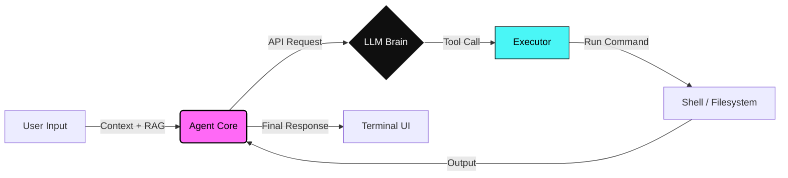

<div align="center">
  
  <h1>./agent-go</h1>
  <p>
    <strong>Chat less. Execute more.</strong> <br>
    The native Go agent that lives in your terminal and does the work.
  </p>

  <!-- Branded Badges -->
  <a href="https://golang.org/">
    
  </a>
  <a href="https://github.com/finettt/agent-go/blob/main/LICENSE">
    
  </a>
  <a href="#">
    
  </a>
  <a href="https://github.com/finettt/agent-go/releases">
    
  </a>
  <a href="https://zread.ai/finettt/agent-go" target="_blank">
    
  </a>
</div>

<br />

<div align="center">
  
</div>

---

## ⚡ Quick Install

Get the binary and start executing in seconds.

**Standard Install (Pre-built)**
```bash
curl -fsSL https://raw.githubusercontent.com/finettt/agent-go/main/install-agent-go.sh | bash
```

**Rolling Install (Build from Source)**
```bash
curl -fsSL https://raw.githubusercontent.com/finettt/agent-go/main/install-agent-go.sh | ROLLING=1 bash
```

---

##  What is Agent-Go?

**Agent-Go** is a brutalist, command-line AI agent written in Go. It doesn't just chat; it integrates with your shell to **execute commands**, manage files, and automate workflows.

It is a modern rewrite of the original [Agent-C](https://github.com/finettt/agent-c), re-architected for speed, concurrency, and better tooling.

### The Workflow



---

##  Key Features

| Capability | Description |
| :--- | :--- |
| **Native Execution** | Executes shell commands directly (`ls`, `git`, `docker`, etc.) with `&&` chaining support. |
| **Pipeline Integration** 🚀 | Full Unix pipeline support with stdin/stdout redirection, clean output, and automatic TTY detection. |
| **Agent Studio** | Create, manage, and spawn specialized sub-agents with the `/agent` command family. |
| **Infinite Memory** | Intelligent token compression ensures your conversation context is never lost. |
| **RAG Engine** | Enable `/rag` to let the agent read your local codebase and documentation for context. |
| **MCP Integration** | Connects to **Model Context Protocol** servers (includes `context7` for docs). |
| **Project Memory** | Persistent Notes and Todo lists that stick with your project across sessions. |
| **Sub-Agents** | Spawns autonomous background threads to handle complex tasks while you keep working. |
| **Checkpoint System** | Save and restore work progress with checkpoint and rollback capabilities. |
| **Mini Model Integration** | Use lightweight models for utility tasks to optimize costs. |
| **Enhanced Token Tracking** | Accurate context tracking with "Last Usage" algorithm for better memory management. |

---

## Usage

### Interactive Mode
Start the binary to enter the loop.
```bash
agent-go
```

**Workflow Example:**
```text
> Create a Python script that prints "Hello, World!" and then run it
$ echo 'print("Hello, World!")' > hello.py && python hello.py
Created hello.py and executed successfully.
Hello, World!
```

### Single Shot (Headless)
Perfect for CI/CD or scripting.
```bash
agent-go "Create a new directory called 'test-project' and navigate into it"
```

### Pipeline Mode 🚀 NEW
Agent-Go now integrates seamlessly with Unix shell pipelines and redirection operators.

**Features:**
- **Clean Output**: Only the final AI response (no colors, no metadata)
- **Silent Tool Execution**: Tools run without prompts or status messages
- **Automatic TTY Detection**: Colors disabled for non-TTY output
- **Proper Error Handling**: Errors sent to stderr with appropriate exit codes

**Examples:**
```bash
# Pipe input to agent-go
echo "Hello World" | agent-go "translate to Spanish"

# Read from file
agent-go "summarize this document" < README.md

# Write output to file
agent-go "generate a Python hello world script" > hello.py

# Append to file
cat header.txt | agent-go "add a docstring" >> script.py

# Chain with other commands
cat access.log | agent-go "extract all error messages" | grep "404"

# Process data in pipelines
git diff | agent-go "review these changes for bugs" | tee review.md

# Multi-step data transformation
cat data.json | agent-go "convert to CSV" > data.csv
```

**Real-world Use Cases:**
```bash
# Log analysis
tail -f /var/log/syslog | agent-go "summarize errors in real-time"

# Code review automation
git diff main..feature | agent-go "create a code review summary"

# Documentation generation
ls -la | agent-go "create a markdown table of these files"

# Data processing
curl -s https://api.example.com/data | agent-go "extract user emails" > emails.txt
```

### Agent Studio & Slash Commands
Control the environment with `/` commands.

*   `/agent studio` - Interactively build a new custom agent.
*   `/session save` - Snapshot your current workspace context.
*   `/rag on` - Activate local file awareness.
*   `/shell` - Drop into a standard system shell (bypass AI).

> Type `/help` inside the tool for the full command list.

---

## Configuration

Agent-Go looks for config in this order:
1.  **Environment Variables** (Highest Priority)
2.  **Config File** (`~/.config/agent-go/config.json`)
3.  **Defaults**

**Essential Env Vars:**
```bash
export OPENAI_KEY="sk-..."             # Required
export OPENAI_MODEL="gpt-4-turbo"      # Recommended
export RAG_ENABLED=1                   # Enable local file search
export AUTO_COMPRESS=1                 # Enable infinite memory
```

> **Note:** As of v2.0.0, the `OperationMode` configuration is deprecated. Use the `/plan` command to toggle between plan/build modes instead.

### Custom Instructions (`AGENTS.md`)
Drop an `AGENTS.md` file in your current directory to give the agent project-specific rules.
```markdown
# AGENTS.md
- Always write comments in Go code.
- Use 'main' branch for git operations.
- Be sarcastic.
```

---

## Architecture

Agent-Go is built for modularity and speed.

*   **`src/executor.go`**: The safety valve. Manages platform-aware shell execution (`sh`/`cmd.exe`).
*   **`src/api.go`**: The bridge. Handles OpenAI-compatible streams and tool definitions.
*   **`src/rag.go`**: The eyes. Indexes local content for retrieval.
*   **`src/subagent.go`**: The crew. Manages background agent lifecycles.

For deep dives, check the [`/docs`](docs/) directory.

---

## Contributing

We welcome pull requests. If you want to add a feature:

1.  Fork it.
2.  Branch it (`git checkout -b feature/cyber-upgrade`).
3.  Commit it.
4.  Push it.

**Development Build:**
```bash
git clone https://github.com/finettt/agent-go.git
make run
```

---

<div align="center">
  <p>Built with 🖤 and Go.</p>
  
</div>
