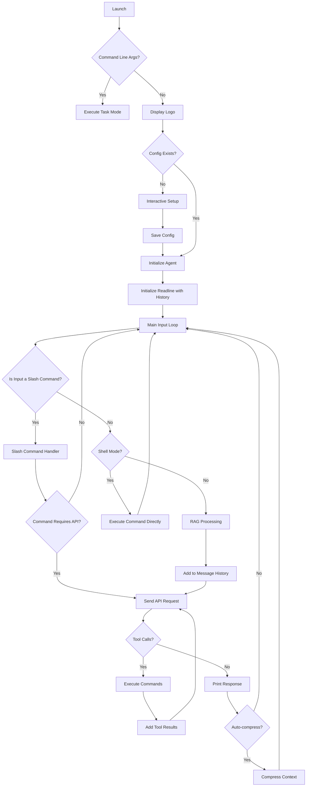

# Architecture

## Overview

Agent-Go is a sophisticated command-line AI assistant that integrates with OpenAI-compatible APIs to provide intelligent responses and execute shell commands. The architecture is designed to be modular, maintainable, and extensible, with a focus on user experience and security.

## Flow Diagram

The application follows a clear, sequential flow from launch to command execution.

## Core Components

### 1. Main Application (`main.go`)

The main application serves as the entry point and orchestrates the overall flow:

- **Initialization**: Loads configuration, sets up the agent, and initializes the system prompt
- **CLI Loop**: Manages the interactive command-line interface using the `readline` library with enhanced features
- **Signal Handling**: Graceful shutdown handling with Ctrl+C and proper cleanup
- **Message Management**: Maintains unlimited conversation history with intelligent compression
- **Logo Display**: ASCII art logo for brand recognition
- **Setup Wizard**: Interactive first-time configuration for new users
- **Custom Instructions**: Support for AGENTS.md file for custom agent behavior
- **Command Line Task Execution**: Direct task execution without interactive mode
- **Shell Mode**: Direct command execution interface for interactive shell sessions

### 2. Configuration Management (`config.go`)

Handles configuration loading and management with hierarchical precedence:

- **Configuration Sources**: Environment variables → Config file → Default values
- **Validation**: Ensures required fields are present and valid
- **Persistence**: Saves configuration to `~/.config/agent-go/config.json`
- **RAG Configuration**: Separate settings for Retrieval-Augmented Generation
- **Model Management**: Default model settings and validation
- **Context Management**: Auto-compression settings and context length configuration
- **Environment Variable Support**: Comprehensive environment variable override support

### 3. API Communication (`api.go`)

Manages communication with OpenAI-compatible APIs:

- **Request Building**: Constructs API requests with proper headers and payload
- **Response Handling**: Processes API responses and extracts assistant messages
- **Error Handling**: Comprehensive error handling for network and API issues
- **Streaming Support**: Real-time token-by-token streaming for interactive user experience.
- **Tool Calling**: Supports function/tool calling for command execution
- **Model Flexibility**: Works with any OpenAI-compatible API provider
- **Retry Logic**: Basic retry mechanism for transient failures
- **Context Compression**: Intelligent conversation summarization using AI
- **Token Tracking**: Real-time token usage monitoring and management

### 4. Command Execution (`executor.go`)

Handles secure shell command execution:

- **Security**: Platform-aware command execution with proper validation
- **Output Handling**: Captures both stdout and stderr for command feedback
- **Error Handling**: Provides detailed error information for failed commands
- **Multi-step Execution**: Supports chained commands with `&&` operator
- **Platform Independence**: Works across different operating systems (Windows, macOS, Linux)
- **Command Display**: Shows executed commands with color coding for user feedback

### 5. RAG System (`rag.go`)

Implements Retrieval-Augmented Generation for local document search:

- **File Search**: Searches through local files for relevant content using fuzzy matching
- **Context Enhancement**: Provides relevant context to the AI for better responses
- **Configurable**: Adjustable search parameters and snippet count
- **File Type Support**: Supports multiple document formats (txt, md, json, etc.)
- **Performance**: Optimized search algorithm for large document collections
- **Recursive Search**: Searches subdirectories for comprehensive document coverage
- **Error Resilience**: Gracefully handles file access errors and permission issues

### 6. Auto-completion (`completion.go`)

Provides intelligent command-line autocompletion:

- **Model Completion**: Fetches available models from the API for autocompletion
- **Command Completion**: Built-in completion for slash commands
- **Dynamic Loading**: Loads completions at startup for better performance
- **Error Resilience**: Graceful handling of API failures during model fetching
- **Extensible**: Easy to add new completion items
- **Prefix-based Completion**: Uses readline library for efficient completion matching
- **Fallback Support**: Provides default completions when API is unavailable

### 7. Data Types (`types.go`)

Defines the core data structures used throughout the application:

- **Message**: Represents conversation messages with role and content
- **Config**: Configuration structure with all settings
- **API Request/Response**: Structures for API communication
- **RAG Settings**: Dedicated structures for RAG configuration
- **Tool Calls**: Function calling structures for command execution
- **Command Arguments**: Structured command parameters for safe execution

## Enhanced Features

### Interactive Setup

The application includes an interactive setup wizard for first-time users:

1. Detects missing API key
2. Prompts user for API key input
3. Validates and saves configuration
4. Provides user feedback throughout the process

### Custom Agent Instructions

Support for `AGENTS.md` file for custom agent behavior:

- **Automatic Detection**: Scans for AGENTS.md in the current directory
- **Prepend Logic**: Custom instructions are prepended to the system prompt
- **Error Handling**: Graceful handling of missing or invalid AGENTS.md files
- **User Feedback**: Notifies users when custom instructions are loaded

### Enhanced CLI Experience

- **Command History**: Persistent command history across sessions
- **Command History**: Persistent command history stored in `~/.config/agent-go/history.txt`
- **Auto-completion**: Intelligent suggestions for commands and models, dynamically fetched from API
- **Error Messages**: Clear, user-friendly error messages with actionable suggestions
- **Visual Feedback**: Token usage displayed in real-time with color coding (green)
- **Unlimited Context**: No message count limits with intelligent compression
- **Token Tracking**: Cumulative token usage monitoring throughout the session
- **Shell Mode**: Direct command execution interface for interactive sessions with `exit` to return
- **Multi-line Support**: Proper handling of complex command input
- **Color Coding**: Commands (red), AI responses (blue), token info (green) using ANSI codes

## Data Flow

1. **Application Start**: Display logo and load configuration
2. **Setup Check**: If no API key, run interactive setup
3. **Agent Initialization**: Create agent with system prompt
4. **Custom Instructions**: Load AGENTS.md if available
5. **CLI Loop**: Start interactive command-line interface
6. **User Input**: User enters a command or question
7. **Preprocessing**: Input is trimmed and validated
8. **Slash Command Handling**: If input starts with `/`, it's processed as a command
9. **RAG Processing**: If enabled, local documents are searched for relevant context
10. **Message History**: User input is added to the conversation history (unlimited)
11. **API Request**: Complete conversation history is sent to the AI
12. **Response Processing**: AI response is parsed and validated
13. **Tool Execution**: If the AI requests command execution, it's handled by the executor
14. **Response Display**: Results are displayed to the user
15. **Graceful Shutdown**: Handle interrupt signals for clean exit

## Context Management

Agent-Go now supports unlimited conversation history with intelligent compression capabilities:

### Unlimited Context
- **No Message Limits**: Removed the previous 20-message constraint
- **Memory Management**: While unlimited, users should be mindful of very long conversations
- **Token Management**: Users can use `/compress` to manage context length
- **Auto-compression**: Automatically compresses context when approaching token limits

### Context Compression
- **Intelligent Summarization**: Uses the same AI model to compress conversation history
- **New Chat Threads**: Creates fresh chat sessions with compressed context as system message
- **Key Information Preservation**: Maintains important details and conversation flow
- **AGENTS.md Integration**: Automatically includes custom instructions in new sessions
- **Configurable Threshold**: Users can set auto-compression thresholds

### Compression Process
1. **Trigger**: User executes `/compress` command or auto-compression threshold is reached
2. **Validation**: Checks if there are messages to compress
3. **API Request**: Sends conversation history to AI for summarization
4. **New Session**: Creates fresh agent with compressed summary as system prompt
5. **Continuity**: Maintains context while starting fresh conversation thread
6. **Token Reset**: Resets token counter after compression

### Auto-compression Logic
- **Threshold**: Automatically compresses when token count exceeds 75% of context length
- **Configurable**: Users can adjust the threshold via environment variables
- **Smart Detection**: Only compresses when there are sufficient messages to summarize
- **User Notification**: Clearly informs users when context is compressed

## Security Considerations

- **Command Validation**: Commands are validated before execution to prevent dangerous operations
- **API Key Protection**: API keys are stored securely in the configuration file with proper permissions
- **Input Sanitization**: User input is properly sanitized before processing
- **Path Validation**: File paths are validated to prevent directory traversal attacks
- **Environment Isolation**: Commands are executed in a controlled environment
- **Platform Security**: Platform-specific command execution with appropriate shell handling
- **Configuration Security**: Secure file permissions for configuration files
- **Error Message Sanitization**: Error messages are sanitized to prevent information leakage

## Performance Optimizations

- **Lazy Loading**: Models are fetched only when needed for autocompletion
- **Connection Pooling**: HTTP client reuse for better performance
- **Memory Management**: Efficient memory usage with bounded message history
- **Caching**: Configuration caching to avoid repeated file I/O
- **RAG Search Optimization**: Efficient file walking and content matching
- **Token Management**: Real-time token tracking to avoid context overflow
- **Auto-completion Caching**: Model list caching to reduce API calls
- **Graceful Degradation**: Continues functioning even when some features fail

## Extensibility

The modular architecture allows for easy extension:

- **New Tools**: Additional tools can be added by extending the executor
- **New APIs**: Support for additional AI providers can be added
- **New Features**: New features can be added without disrupting existing functionality
- **Plugin System**: Designed to support future plugin architecture
- **Custom Commands**: Easy addition of new slash commands
- **Custom Prompts**: AGENTS.md support for personalized agent behavior
- **Configuration Extensibility**: Easy addition of new configuration options
- **Modular Design**: Clean separation of concerns for easy maintenance

## Error Handling Strategy

- **Graceful Degradation**: Application continues to function even if some features fail
- **User Feedback**: Clear error messages and suggestions for resolution
- **Logging**: Comprehensive error logging for debugging
- **Recovery**: Automatic recovery from transient errors where possible
- **Error Categories**: Different handling for network errors, API errors, and execution errors
- **User Guidance**: Helpful suggestions for common error scenarios
- **Fallback Mechanisms**: Graceful fallbacks when external services are unavailable

## Testing Strategy

- **Unit Tests**: Individual component testing
- **Integration Tests**: End-to-end workflow testing
- **Mock APIs**: Testing with mock API responses
- **Security Testing**: Command validation and security testing
- **Cross-platform Testing**: Verification across different operating systems
- **Configuration Testing**: Testing various configuration scenarios
- **Performance Testing**: Load testing and performance optimization
- **Error Scenario Testing**: Comprehensive error condition testing
