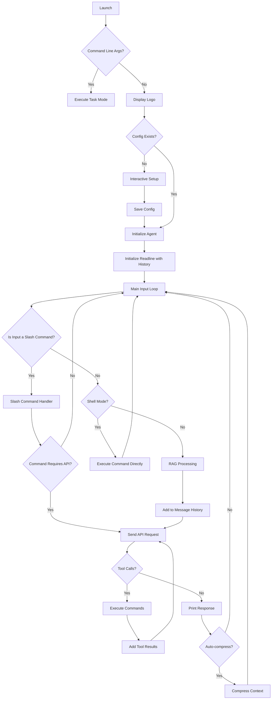

# Architecture

## Overview

Agent-Go is a sophisticated command-line AI assistant that integrates with OpenAI-compatible APIs to provide intelligent responses and execute shell commands. The architecture is designed to be modular, maintainable, and extensible, with a focus on user experience and security.

## Flow Diagram

The application follows a clear, sequential flow from launch to command execution.

## Core Components

### 1. Main Application (`main.go`)

The main application serves as the entry point and orchestrates the overall flow:

- **Initialization**: Loads configuration, sets up the agent, and initializes the system prompt
- **CLI Loop**: Manages the interactive command-line interface using the `readline` library with enhanced features
- **Signal Handling**: Graceful shutdown handling with Ctrl+C and proper cleanup
- **Message Management**: Maintains unlimited conversation history with intelligent compression
- **Logo Display**: ASCII art logo for brand recognition
- **Setup Wizard**: Interactive first-time configuration for new users
- **Custom Instructions**: Support for AGENTS.md file for custom agent behavior
- **Command Line Task Execution**: Direct task execution without interactive mode
- **Shell Mode**: Direct command execution interface for interactive shell sessions
- **Plan/Build Agents**: Agent-based approach where plan and build are separate agent definitions with different tool access (replaces the deprecated `operation_mode` config flag)
- **YOLO Mode**: "You Only Look Once" mode for rapid, uninterrupted command execution without confirmation prompts via `execution_mode`

### 2. Configuration Management (`config.go`)

Handles configuration loading and management with hierarchical precedence:

- **Configuration Sources**: Environment variables → Config file → Default values
- **Validation**: Ensures required fields are present and valid
- **Persistence**: Saves configuration to `~/.config/agent-go/config.json`
- **RAG Configuration**: Separate settings for Retrieval-Augmented Generation
- **Model Management**: Default model settings (main and mini models) and validation
- **Context Management**: Auto-compression settings and context length configuration (default: 262144 tokens)
- **Environment Variable Support**: Comprehensive environment variable override support
- **Deprecated Fields**: `operation_mode` retained for backward compatibility but emits deprecation warnings

### 3. API Communication (`api.go`)

Manages communication with OpenAI-compatible APIs:

- **Request Building**: Constructs API requests with proper headers and payload
- **Response Handling**: Processes API responses and extracts assistant messages
- **Error Handling**: Comprehensive error handling for network and API issues
- **Streaming Support**: Real-time token-by-token streaming for interactive user experience.
- **Tool Calling**: Supports function/tool calling for command execution, including todo list management
- **Model Flexibility**: Works with any OpenAI-compatible API provider
- **Retry Logic**: Basic retry mechanism for transient failures
- **Context Compression**: Intelligent conversation summarization using AI
- **Token Tracking**: Real-time token usage monitoring with "Last Usage" algorithm (current context from most recent API response)

### 4. Command Execution (`executor.go`)

Handles secure shell command execution:

- **Security**: Platform-aware command execution with proper validation
- **Output Handling**: Captures both stdout and stderr for command feedback
- **Error Handling**: Provides detailed error information for failed commands
- **Multi-step Execution**: Supports chained commands with `&&` operator
- **Platform Independence**: Works across different operating systems (Windows, macOS, Linux)
- **Command Display**: Shows executed commands with color coding for user feedback
- **Ask/YOLO Modes**: Configurable execution safety with "Ask" (confirm before run) and "YOLO" (auto-run) modes via `execution_mode`
- **Plan Agent Restriction**: Plan agent has restricted tool access (no `execute_command`), enforced via agent definition

### 5. Tool Management (`tools.go` and `processor.go`)

Defines and processes available tools for the AI agent:

**tools.go:**

- **Tool Definitions**: Defines schemas for all available tools
- **Tool Registry**: Manages which tools are available to the agent
- **Conditional Tools**: Some tools (like `spawn_agent`) are conditionally available
- **Built-in Tools**: `execute_command`, `create_todo`, `update_todo`, `get_todo_list`, `use_mcp_tool`
- **Schema Validation**: Ensures tool parameters match expected types

**processor.go:**

- **Tool Call Processing**: Handles execution of tool calls from API responses
- **Error Handling**: Manages tool execution errors gracefully
- **Result Formatting**: Formats tool output for the AI
- **Tool Coordination**: Coordinates between different tool types
- **Sub-agent Integration**: Handles `spawn_agent` tool calls

### 6. RAG System (`rag.go`)

Implements Retrieval-Augmented Generation for local document search:

- **File Search**: Searches through local files for relevant content using fuzzy matching
- **Context Enhancement**: Provides relevant context to the AI for better responses
- **Configurable**: Adjustable search parameters and snippet count
- **File Type Support**: Supports multiple document formats (txt, md, json, etc.)
- **Performance**: Optimized search algorithm for large document collections
- **Recursive Search**: Searches subdirectories for comprehensive document coverage
- **Error Resilience**: Gracefully handles file access errors and permission issues

### 7. MCP Integration (`mcp.go`)

Manages Model Context Protocol server connections and tool calls:

- **Server Management**: Manages connections to multiple MCP servers
- **Client Sessions**: Maintains persistent client sessions for each server
- **Tool Discovery**: Automatically discovers available tools from connected servers
- **Tool Execution**: Executes MCP tool calls and returns results
- **Default Configuration**: Auto-configures context7 server for library documentation
- **Connection Pooling**: Reuses connections for better performance
- **Error Handling**: Graceful handling of server connection and tool call errors
- **Dynamic Tool Loading**: Tools are loaded dynamically from server schemas

**MCP Server Types:**

- **stdio-based**: Local servers using standard input/output (e.g., `npx -y @upstash/context7-mcp`)
- **Command-based**: Servers launched via shell commands

### 8. Sub-agent System (`subagent.go`)

Manages autonomous sub-agents for complex task delegation:

- **Isolated Execution**: Each sub-agent has its own message history and context
- **Iteration Limits**: Maximum 50 iterations per sub-agent to prevent infinite loops
- **Tool Access**: Sub-agents have access to `execute_command` and todo tools
- **No Nested Spawning**: Sub-agents cannot spawn additional sub-agents
- **UUID Tracking**: Each sub-agent has a unique identifier
- **Result Aggregation**: Sub-agent results are returned to the main agent
- **Independent Todo Lists**: Each sub-agent maintains its own todo list

### 9. Todo List Management (`todo.go`)

Provides persistent task tracking across sessions:

- **Persistent Storage**: Todos stored in `~/.config/agent-go/todos/{agent_id}.json`
- **Per-Agent Lists**: Each agent (main and sub-agents) has separate todo lists
- **Status Tracking**: Supports pending, in-progress, and completed statuses
- **Auto-increment IDs**: Automatic ID assignment for new todos
- **CRUD Operations**: Create, read, update operations via tools
- **Data Validation**: Validates todo statuses and prevents invalid updates
- **JSON Storage**: Human-readable JSON format for easy inspection

### 10. Agent Studio (`agents.go`)

Provides complete agent management system for creating, managing, and using task-specific agents:

- **Agent Studio Interface**: Interactive chat interface for agent creation via `/agent studio`
- **Agent Management**: Full CRUD operations for agent definitions (list, view, use, clear, delete)
- **Persistent Storage**: Agent definitions stored in `~/.config/agent-go/agents/*.json`
- **Built-in Agent**: Protected `default` agent that cannot be deleted or overwritten
- **Subagent Support**: Task-specific agents can be used by subagents via `{"agent": "name"}` parameter
- **Context Isolation**: Each agent maintains separate context and message history
- **Model Override Support**: Agents can specify custom model settings (temperature, max_tokens)
- **Validation**: Built-in validation to prevent overwriting protected agents
- **Studio Restrictions**: Agent Studio only permits agent creation and rejects all other tools

### 11. Session Management (`session.go`)

Provides session save/restore functionality for seamless context switching:

- **Session Creation**: `/session new` - saves current context and creates new session
- **Session Listing**: `/session list` - displays all saved sessions with metadata
- **Session Restoration**: `/session restore <name>` - restores previous session context
- **Session Deletion**: `/session rm <name>` - removes saved session from storage
- **Automatic Saving**: Sessions auto-saved on exit and context clear events
- **Persistent Storage**: Sessions stored in `~/.config/agent-go/sessions/*.json`
- **Context Preservation**: Full conversation history and state preservation
- **Timestamp Tracking**: Records creation and last access times for sessions
- **Startup Restoration**: Enhanced startup with session restoration capabilities

### 12. Background Command Execution (`executor.go`)

Extended command execution with background process support:

- **Background Execution**: `execute_command` with `background` parameter for async operations
- **Process Management**: PID tracking and management for background processes
- **Output Streaming**: Real-time output capture and display for background commands
- **Command Monitoring**: `get_background_logs`, `list_background_commands` tools for tracking
- **Process Termination**: `kill_background_command` tool for stopping running processes
- **Application Safety**: Prevents exit when background tasks are running
- **Resource Management**: Automatic cleanup of completed background processes
- **Status Tracking**: Real-time status monitoring for background tasks

### 13. Notes Management (`notes.go`)

Provides persistent knowledge storage across sessions:

- **Persistent Storage**: Notes stored in `.agent-go/notes/` as JSON files
- **System Integration**: Notes automatically injected into system prompt for context
- **CRUD Operations**: Create, read, update, delete operations via tools
- **Autocomplete Support**: Tab completion for note names and commands
- **Metadata Tracking**: Tracks creation and update timestamps
- **Cross-Session Persistence**: Notes available across different agent sessions
- **JSON Storage**: Human-readable JSON format for easy inspection
- **Note Mentions**: Support for `#note-name` syntax to inject note content

### 14. Auto-completion (`completion.go`)

Provides intelligent command-line autocompletion:

- **Model Completion**: Fetches available models from the API for autocompletion
- **Command Completion**: Built-in completion for slash commands
- **Dynamic Loading**: Loads completions at startup for better performance
- **Error Resilience**: Graceful handling of API failures during model fetching
- **Extensible**: Easy to add new completion items
- **Prefix-based Completion**: Uses readline library for efficient completion matching
- **Fallback Support**: Provides default completions when API is unavailable

### 15. System Information (`system.go`)

Gathers system context for the AI:

- **OS Detection**: Identifies operating system and architecture
- **Distribution Info**: Detects Linux distribution from `/etc/os-release`
- **Current Directory**: Provides working directory context
- **Timestamp**: Includes current time in system prompt
- **Cross-platform**: Works on Windows, macOS, and Linux

### 16. Session Export (`export.go`)

Provides session export functionality for documentation, analysis, and sharing:

- **Multiple Formats**: Support for markdown, JSON, and plain text exports
- **Metadata Inclusion**: Optional metadata (timestamps, token usage, agent info)
- **Custom Filenames**: Auto-generated or user-specified filenames
- **Full Content Export**: Complete conversation history including tool calls and reasoning
- **Export Directory**: Exports saved to `.agent-go/exports/`
- **Session Selection**: Export current session or specific saved sessions
- **Tool Integration**: Available as `export_session` tool for agent use

### 17. Data Types (`types.go`)

Defines the core data structures used throughout the application:

- **Message**: Represents conversation messages with role and content
- **Config**: Configuration structure with all settings (including deprecated `operation_mode`)
- **API Request/Response**: Structures for API communication
- **RAG Settings**: Dedicated structures for RAG configuration
- **Tool Calls**: Function calling structures for command execution
- **Todo List**: Structures for managing todo lists
- **Note**: Structures for managing persistent notes
- **Command Arguments**: Structured command parameters for safe execution
- **MCP Types**: MCP server configuration and tool arguments
- **Streaming Types**: Structures for handling streaming responses
- **Agent Type**: Agent structure with ID, message history, and active agent definition name
- **Agent Definition**: Structure for task-specific agent configurations (system prompt, model overrides)
- **Session**: Structure for saving/restoring conversation state with token tracking

### 17. Session Export (`export.go`)

Provides session export functionality for documentation, analysis, and sharing:

- **Multiple Formats**: Support for markdown, JSON, and plain text exports
- **Metadata Inclusion**: Optional metadata (timestamps, token usage, agent info)
- **Custom Filenames**: Auto-generated or user-specified filenames
- **Full Content Export**: Complete conversation history including tool calls and reasoning
- **Export Directory**: Exports saved to `.agent-go/exports/`
- **Session Selection**: Export current session or specific saved sessions
- **Tool Integration**: Available as `export_session` tool for agent use

## Enhanced Features

### Interactive Setup

The application includes an interactive setup wizard for first-time users:

1. Detects missing API key
2. Prompts user for API key input
3. Validates and saves configuration
4. Provides user feedback throughout the process

### MCP (Model Context Protocol) Integration

Agent-Go integrates with MCP servers to extend functionality:

- **Server Registry**: Maintains a registry of configured MCP servers
- **Automatic Connection**: Connects to servers on-demand when tools are needed
- **Tool Discovery**: Automatically discovers and includes MCP tools in system prompt
- **Default Server**: context7 server is auto-configured for library documentation
- **Dynamic Configuration**: Users can add/remove servers via `/mcp` commands
- **Tool Information**: MCP tools and descriptions are injected into the system prompt

**MCP Workflow:**

1. Server configuration stored in config.json
2. On startup or tool use, client connects to server
3. Server capabilities are queried (tools, resources)
4. Tool information is added to system prompt
5. AI can call MCP tools via `use_mcp_tool` function
6. Results are processed and returned to the conversation

### Custom Agent Instructions

Support for `AGENTS.md` file for custom agent behavior:

- **Automatic Detection**: Scans for AGENTS.md in the current directory
- **Prepend Logic**: Custom instructions are prepended to the system prompt
- **Error Handling**: Graceful handling of missing or invalid AGENTS.md files
- **User Feedback**: Notifies users when custom instructions are loaded

### Enhanced CLI Experience

- **Command History**: Persistent command history stored in `~/.config/agent-go/history.txt`
- **Auto-completion**: Intelligent suggestions for commands and models, dynamically fetched from API
- **Enhanced Autocomplete**: Extended completion for `/agent` commands, agent names, and session names
- **Error Messages**: Clear, user-friendly error messages with actionable suggestions
- **Visual Feedback**: Token usage displayed based on verbosity mode (1=Silent, 2=Basic, 3=Detailed)
- **Unlimited Context**: No message count limits with intelligent compression
- **Token Tracking**: Dual tracking - current context (from last API response) and cumulative session stats
- **Shell Mode**: Direct command execution interface for interactive sessions with `exit` to return
- **Multi-line Support**: Proper handling of complex command input
- **Color Coding**: Commands (red), AI responses (blue), token info (green) using ANSI codes
- **New Color Scheme**: Enhanced theming with consistent colors (#FF93FB, #FFF, #AAA)
- **/edit Command**: New slash command to compose prompts using nano text editor
- **Usage Tracking**: `/usage` and `/cost` commands for detailed token and cost monitoring
- **Verbose Mode**: `/verbose` command for enhanced logging control
- **Security Review**: `/security` command to spawn subagent for code review

### Tool Loop Detection

Automatically detects when the AI gets stuck in infinite loops of calling the same tool with identical arguments:

- **Loop Detection**: Monitors tool calls within a single API response and across multiple iterations
- **Threshold**: Triggers after 3 repeated calls of the same tool with identical arguments
- **Intervention**: Injects a `ToolLoopStopMessage` to guide the model toward alternative approaches
- **Scope**: Applied to all execution modes (CLI, task, pipeline, editor) and sub-agents
- **Implementation**: Uses `checkToolLoop()` function with `getToolCallSignature()` helper to detect patterns

### Empty Response Retry Logic

Intelligent retry mechanism for handling empty model responses:

- **Detection**: Identifies empty responses (zero choices, empty content, no tool calls)
- **Retry Limit**: Up to 3 automatic retry attempts
- **Feedback**: Warns user about empty responses and retry attempts via stderr
- **Scope**: Applied to all execution modes (interactive CLI, single task mode, pipeline mode)
- **Resilience**: Improves stability by handling transient API issues gracefully

### Time Context Injection

Provides temporal awareness to the AI by injecting current time information:

- **Time Format**: UTC time in ISO 8601 format, local time in RFC1123 format
- **Timezone Info**: Includes timezone name and UTC offset (e.g., UTC+03:00)
- **Format**: "Current Time: 2026-01-29T14:30:00Z (UTC) | Local: Thu, 29 Jan 2026 17:30:00 MSK | Timezone: MSK (UTC+03:00)"
- **Implementation**: `getCurrentTimeContext()` function in `system.go`
- **Integration**: Injected as a system message in API requests via `sendAPIRequest()` and `sendMiniLLMRequest()`
- **Benefits**: Enables time-aware operations and improves context for scheduling tasks

## Data Flow

1. **Application Start**: Display logo and load configuration
2. **Setup Check**: If no API key, run interactive setup
3. **Agent Initialization**: Create agent with system prompt
4. **Custom Instructions**: Load AGENTS.md if available
5. **CLI Loop**: Start interactive command-line interface
6. **User Input**: User enters a command or question
7. **Preprocessing**: Input is trimmed and validated
8. **Slash Command Handling**: If input starts with `/`, it's processed as a command
9. **RAG Processing**: If enabled, local documents are searched for relevant context
10. **Message History**: User input is added to the conversation history (unlimited)
11. **API Request**: Complete conversation history is sent to the AI
12. **Response Processing**: AI response is parsed and validated
13. **Tool Execution**: If the AI requests command execution, it's handled by the executor
14. **Response Display**: Results are displayed to the user
15. **Graceful Shutdown**: Handle interrupt signals for clean exit

## Context Management

Agent-Go now supports unlimited conversation history with intelligent compression capabilities:

### Unlimited Context

- **No Message Limits**: Removed the previous 20-message constraint
- **Memory Management**: Tracks context via "Last Usage" algorithm (current context = total_tokens from most recent API response)
- **Token Management**: Users can use `/compress` to manage context length
- **Auto-compression**: Automatically compresses context at 75% of `model_context_length` (default: 262144 tokens)

### Context Compression

- **Intelligent Summarization**: Uses the same AI model to compress conversation history
- **New Chat Threads**: Creates fresh chat sessions with compressed context as system message
- **Key Information Preservation**: Maintains important details and conversation flow
- **AGENTS.md Integration**: Automatically includes custom instructions in new sessions
- **Configurable Threshold**: Users can set auto-compression thresholds

### Compression Process

1. **Trigger**: User executes `/compress` command or auto-compression threshold is reached
2. **Validation**: Checks if there are messages to compress
3. **API Request**: Sends conversation history to AI for summarization
4. **New Session**: Creates fresh agent with compressed summary as system prompt
5. **Continuity**: Maintains context while starting fresh conversation thread
6. **Token Reset**: Resets token counter after compression

### Auto-compression Logic

- **Threshold**: Automatically compresses when `currentContextTokens` exceeds 75% of `model_context_length`
- **Configurable**: Users can adjust `model_context_length` and enable/disable via config or `/contextlength` command
- **Smart Detection**: Only compresses when there are sufficient messages to summarize
- **User Notification**: Clearly informs users when context is compressed with percentage display
- **Token Reset**: Resets current context tokens to 0 after compression; session cumulative stats continue

## Security Considerations

- **Command Validation**: Commands are validated before execution to prevent dangerous operations
- **API Key Protection**: API keys are stored securely in the configuration file with proper permissions
- **Input Sanitization**: User input is properly sanitized before processing
- **Path Validation**: File paths are validated to prevent directory traversal attacks
- **Environment Isolation**: Commands are executed in a controlled environment
- **Platform Security**: Platform-specific command execution with appropriate shell handling
- **Configuration Security**: Secure file permissions for configuration files
- **Error Message Sanitization**: Error messages are sanitized to prevent information leakage

## Performance Optimizations

- **Lazy Loading**: Models are fetched only when needed for autocompletion
- **Connection Pooling**: HTTP client reuse for better performance
- **Memory Management**: Efficient memory usage with bounded message history
- **Caching**: Configuration caching to avoid repeated file I/O
- **RAG Search Optimization**: Efficient file walking and content matching
- **Token Management**: Real-time token tracking to avoid context overflow
- **Auto-completion Caching**: Model list caching to reduce API calls
- **Graceful Degradation**: Continues functioning even when some features fail
- **Background Process Management**: Efficient resource management for background commands
- **Session Storage Optimization**: Optimized session data storage and retrieval
- **Agent Definition Caching**: Caching of agent definitions for faster access
- **Parallel Processing**: Support for parallel sub-agent execution with goroutines and WaitGroup

## Extensibility

The modular architecture allows for easy extension:

- **New Tools**: Additional tools can be added to tools.go and processor.go
- **New MCP Servers**: Any MCP-compatible server can be integrated
- **New APIs**: Support for additional AI providers can be added
- **New Features**: New features can be added without disrupting existing functionality
- **Plugin System**: MCP provides a plugin-like architecture
- **Custom Commands**: Easy addition of new slash commands
- **Custom Prompts**: AGENTS.md support for personalized agent behavior
- **Configuration Extensibility**: Easy addition of new configuration options
- **Modular Design**: Clean separation of concerns for easy maintenance

## Error Handling Strategy

- **Graceful Degradation**: Application continues to function even if some features fail
- **User Feedback**: Clear error messages and suggestions for resolution
- **Logging**: Comprehensive error logging for debugging
- **Recovery**: Automatic recovery from transient errors where possible
- **Error Categories**: Different handling for network errors, API errors, and execution errors
- **User Guidance**: Helpful suggestions for common error scenarios
- **Fallback Mechanisms**: Graceful fallbacks when external services are unavailable

## Testing Strategy

- **Unit Tests**: Individual component testing
- **Integration Tests**: End-to-end workflow testing
- **Mock APIs**: Testing with mock API responses
- **Security Testing**: Command validation and security testing
- **Cross-platform Testing**: Verification across different operating systems
- **Configuration Testing**: Testing various configuration scenarios
- **Performance Testing**: Load testing and performance optimization
- **Error Scenario Testing**: Comprehensive error condition testing
