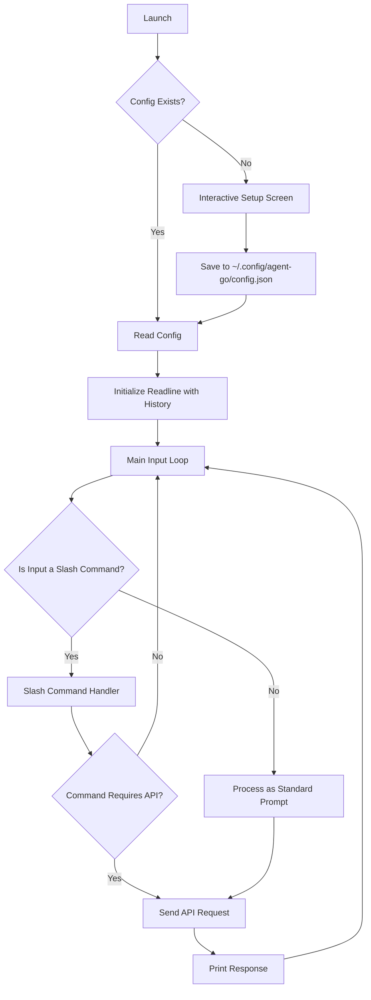

# Architecture

This document outlines the architecture of Agent-Go, a command-line AI assistant.

## Flow Diagram

The application follows a clear, sequential flow from launch to command execution.

## Core Components

- **main.go**: The application's entry point, responsible for initialization, the main CLI loop, and graceful shutdown.
- **config.go**: Manages loading and saving application settings from a JSON file and environment variables.
- **api.go**: Handles all communication with the OpenAI API, including sending requests and processing responses.
- **executor.go**: Executes shell commands requested by the AI model.
- **rag.go**: Implements the Retrieval-Augmented Generation (RAG) feature by searching local files for context.
- **types.go**: Defines all data structures used throughout the application.