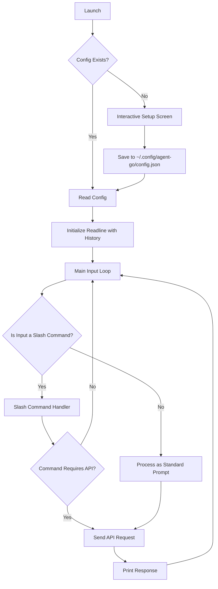

# Architecture

## Overview

Agent-Go is a sophisticated command-line AI assistant that integrates with OpenAI-compatible APIs to provide intelligent responses and execute shell commands. The architecture is designed to be modular, maintainable, and extensible, with a focus on user experience and security.

## Flow Diagram

The application follows a clear, sequential flow from launch to command execution.

## Core Components

### 1. Main Application (`main.go`)

The main application serves as the entry point and orchestrates the overall flow:

- **Initialization**: Loads configuration, sets up the agent, and initializes the system prompt
- **CLI Loop**: Manages the interactive command-line interface using the `readline` library with enhanced features
- **Signal Handling**: Graceful shutdown handling with Ctrl+C and proper cleanup
- **Message Management**: Maintains conversation history with a sliding window of 20 messages
- **Logo Display**: ASCII art logo for brand recognition
- **Setup Wizard**: Interactive first-time configuration for new users
- **Custom Instructions**: Support for AGENTS.md file for custom agent behavior

### 2. Configuration Management (`config.go`)

Handles configuration loading and management with hierarchical precedence:

- **Configuration Sources**: Environment variables → Config file → Default values
- **Validation**: Ensures required fields are present and valid
- **Persistence**: Saves configuration to `~/.config/agent-go/config.json`
- **RAG Configuration**: Separate settings for Retrieval-Augmented Generation
- **Model Management**: Default model settings and validation

### 3. API Communication (`api.go`)

Manages communication with OpenAI-compatible APIs:

- **Request Building**: Constructs API requests with proper headers and payload
- **Response Handling**: Processes API responses and extracts assistant messages
- **Error Handling**: Comprehensive error handling for network and API issues
- **Tool Calling**: Supports function/tool calling for command execution
- **Model Flexibility**: Works with any OpenAI-compatible API provider
- **Retry Logic**: Basic retry mechanism for transient failures

### 4. Command Execution (`executor.go`)

Handles secure shell command execution:

- **Security**: Validates commands before execution to prevent dangerous operations
- **Output Handling**: Captures both stdout and stderr for command feedback
- **Error Handling**: Provides detailed error information for failed commands
- **Multi-step Execution**: Supports chained commands with `&&` operator
- **Platform Independence**: Works across different operating systems

### 5. RAG System (`rag.go`)

Implements Retrieval-Augmented Generation for local document search:

- **File Search**: Searches through local files for relevant content using fuzzy matching
- **Context Enhancement**: Provides relevant context to the AI for better responses
- **Configurable**: Adjustable search parameters and snippet count
- **File Type Support**: Supports multiple document formats (txt, md, json, etc.)
- **Performance**: Optimized search algorithm for large document collections

### 6. Auto-completion (`completion.go`)

Provides intelligent command-line autocompletion:

- **Model Completion**: Fetches available models from the API for autocompletion
- **Command Completion**: Built-in completion for slash commands
- **Dynamic Loading**: Loads completions at startup for better performance
- **Error Resilience**: Graceful handling of API failures during model fetching
- **Extensible**: Easy to add new completion items

### 7. Data Types (`types.go`)

Defines the core data structures used throughout the application:

- **Message**: Represents conversation messages with role and content
- **Config**: Configuration structure with all settings
- **API Request/Response**: Structures for API communication
- **RAG Settings**: Dedicated structures for RAG configuration

## Enhanced Features

### Interactive Setup

The application includes an interactive setup wizard for first-time users:

1. Detects missing API key
2. Prompts user for API key input
3. Validates and saves configuration
4. Provides user feedback throughout the process

### Custom Agent Instructions

Support for `AGENTS.md` file for custom agent behavior:

- **Automatic Detection**: Scans for AGENTS.md in the current directory
- **Prepend Logic**: Custom instructions are prepended to the system prompt
- **Error Handling**: Graceful handling of missing or invalid AGENTS.md files
- **User Feedback**: Notifies users when custom instructions are loaded

### Enhanced CLI Experience

- **Command History**: Persistent command history across sessions
- **Auto-completion**: Intelligent suggestions for commands and models
- **Error Messages**: Clear, user-friendly error messages
- **Progress Indicators**: Visual feedback for long-running operations

## Data Flow

1. **Application Start**: Display logo and load configuration
2. **Setup Check**: If no API key, run interactive setup
3. **Agent Initialization**: Create agent with system prompt
4. **Custom Instructions**: Load AGENTS.md if available
5. **CLI Loop**: Start interactive command-line interface
6. **User Input**: User enters a command or question
7. **Preprocessing**: Input is trimmed and validated
8. **Slash Command Handling**: If input starts with `/`, it's processed as a command
9. **RAG Processing**: If enabled, local documents are searched for relevant context
10. **Message History**: User input is added to the conversation history
11. **History Management**: Conversation history is maintained within limits
12. **API Request**: Complete conversation history is sent to the AI
13. **Response Processing**: AI response is parsed and validated
14. **Tool Execution**: If the AI requests command execution, it's handled by the executor
15. **Response Display**: Results are displayed to the user
16. **Graceful Shutdown**: Handle interrupt signals for clean exit

## Security Considerations

- **Command Validation**: Commands are validated before execution to prevent dangerous operations
- **API Key Protection**: API keys are stored securely in the configuration file with proper permissions
- **Input Sanitization**: User input is properly sanitized before processing
- **Path Validation**: File paths are validated to prevent directory traversal attacks
- **Environment Isolation**: Commands are executed in a controlled environment

## Performance Optimizations

- **Lazy Loading**: Models are fetched only when needed for autocompletion
- **Connection Pooling**: HTTP client reuse for better performance
- **Memory Management**: Efficient memory usage with bounded message history
- **Caching**: Configuration caching to avoid repeated file I/O

## Extensibility

The modular architecture allows for easy extension:

- **New Tools**: Additional tools can be added by extending the executor
- **New APIs**: Support for additional AI providers can be added
- **New Features**: New features can be added without disrupting existing functionality
- **Plugin System**: Designed to support future plugin architecture
- **Custom Commands**: Easy addition of new slash commands

## Error Handling Strategy

- **Graceful Degradation**: Application continues to function even if some features fail
- **User Feedback**: Clear error messages and suggestions for resolution
- **Logging**: Comprehensive error logging for debugging
- **Recovery**: Automatic recovery from transient errors where possible

## Testing Strategy

- **Unit Tests**: Individual component testing
- **Integration Tests**: End-to-end workflow testing
- **Mock APIs**: Testing with mock API responses
- **Security Testing**: Command validation and security testing