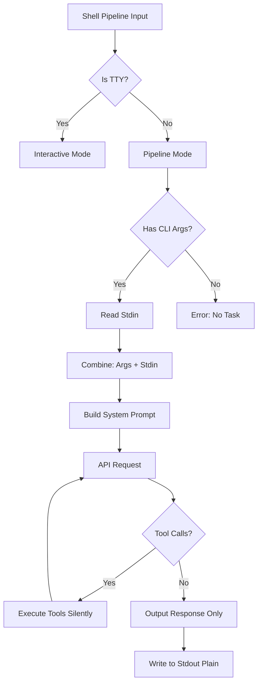

# Shell Pipeline Integration Plan for agent-go

## Overview

This plan details how to integrate `agent-go` with standard Unix shell pipelines and redirection operators (`|`, `>`, `>>`, `<`, `<<`), making it a proper pipeline-friendly CLI tool.

## Requirements Summary

Based on user feedback:
1. **Primary Use Case**: `echo "logs..." | agent-go "summarize these logs"` - CLI args form instructions, stdin is additional context
2. **Output**: Only the final AI response message should be output (no colors, no meta information when piped)
3. **TTY Detection**: Automatically disable ANSI colors and formatting when stdout is not a TTY
4. **Tool Calling**: Allow tools in pipeline mode (agent can still execute commands)

## Current State Analysis

### Existing Capabilities
- [`runTask()`](src/main.go:1698) in [`main.go`](src/main.go:1) already supports command-line task execution
- Outputs to stdout via `fmt.Printf("● %s\n", *assistantMsg.Content)`
- Uses [`readline`](src/main.go:248) only in interactive mode
- No current stdin reading for content in task mode

### Gaps Identified
1. **No stdin reading**: Task mode doesn't check or read from stdin
2. **No TTY detection**: Colors are always printed (defined in [`constants.go`](src/constants.go:1))
3. **Verbose output**: Task mode prints "●" prefix and potentially other metadata
4. **Tool output noise**: Tool execution logs are printed to stdout/stderr

## Architecture Design

### Data Flow Diagram



### Components to Modify

#### 1. **main.go** - Entry Point Logic

**New Function**: `isPipeMode() bool`
```go
// Detects if stdin is being piped or redirected
func isPipeMode() bool {
    stat, _ := os.Stdin.Stat()
    return (stat.Mode() & os.ModeCharDevice) == 0
}
```

**New Function**: `isTTY() bool`
```go
// Detects if stdout is a TTY (for color control)
func isTTY() bool {
    stat, _ := os.Stdout.Stat()
    return (stat.Mode() & os.ModeCharDevice) != 0
}
```

**Modify**: [`main()`](src/main.go:69)
- Check if stdin is piped before deciding interactive vs task mode
- If piped, enter pipeline mode regardless of CLI args

**New Function**: `runPipelineMode(task string, stdinContent string)`
- Similar to [`runTask()`](src/main.go:1698) but:
  - Combines task + stdin into user message
  - Suppresses all tool execution logs
  - Only outputs final assistant content (no prefix, no colors)
  - Handles tool calls silently

#### 2. **constants.go** - Color Management

**Add Global Variables**:
```go
var (
    // These will be set to empty strings when not in TTY
    ColorRed       = "\033[31m"
    ColorGreen     = "\033[32m"
    // ... all existing colors
    ColorReset     = "\033[0m"
)
```

**New Function**: `initializeColors()`
```go
func initializeColors() {
    if !isTTY() {
        // Disable all colors for non-TTY output
        ColorRed = ""
        ColorGreen = ""
        // ... set all to empty string
        ColorReset = ""
    }
}
```

Call this in [`main()`](src/main.go:69) before any output.

#### 3. **processor.go** - Silent Tool Execution

**Add Global Variable**:
```go
var pipelineMode = false
```

**Modify**: [`processToolCalls()`](src/processor.go:13)
- Check `pipelineMode` flag
- When true, suppress all `fmt.Printf` statements
- Still execute tools normally
- Only collect results

#### 4. **executor.go** - Command Execution

**Modify**: [`confirmAndExecute()`](src/executor.go:34)
- In pipeline mode, skip all prompts
- Always execute in foreground (no background in pipeline mode)
- Suppress execution messages

**New Function**: `executeCommandSilent(command string) (string, error)`
- Same as [`executeCommand()`](src/executor.go:71) but with no output
- Used exclusively in pipeline mode

### Input Redirection Support

#### Standard Input (`<`)
```bash
agent-go "summarize" < file.txt
```
**Behavior**: `file.txt` content is read via stdin, combined with "summarize" instruction

#### Here Document (`<<`)
```bash
agent-go "analyze" <<EOF
Line 1
Line 2
EOF
```
**Behavior**: Multi-line stdin content combined with "analyze" instruction

#### Pipe (`|`)
```bash
echo "data" | agent-go "process this"
```
**Behavior**: Command output piped to agent-go stdin, combined with instruction

### Output Redirection Support

#### Overwrite (`>`)
```bash
agent-go "generate script" > script.sh
```
**Behavior**: AI response written to file (works automatically with plain stdout)

#### Append (`>>`)
```bash
agent-go "add comment" >> notes.txt
```
**Behavior**: AI response appended to file (works automatically)

## Implementation Checklist

### Phase 1: Core Pipeline Detection & TTY Handling
- [ ] Add `isPipeMode()` function to detect stdin redirection
- [ ] Add `isTTY()` function to detect stdout TTY
- [ ] Add `initializeColors()` to conditionally disable colors
- [ ] Modify color constants in [`constants.go`](src/constants.go:1) to be variables
- [ ] Update [`main()`](src/main.go:69) to call `initializeColors()` early

### Phase 2: Pipeline Mode Execution
- [ ] Create `runPipelineMode(task, stdinContent)` function
- [ ] Add stdin reading logic using `io.ReadAll(os.Stdin)`
- [ ] Combine CLI args (task) with stdin content in user message format
- [ ] Modify main entry logic to detect and route to pipeline mode
- [ ] Ensure only final assistant content is printed (no "●" prefix)

### Phase 3: Silent Tool Execution
- [ ] Add global `pipelineMode` flag
- [ ] Modify [`processToolCalls()`](src/processor.go:13) to check flag
- [ ] Suppress all `fmt.Printf` tool execution logs when in pipeline mode
- [ ] Modify [`confirmAndExecute()`](src/executor.go:34) to skip prompts in pipeline mode
- [ ] Create `executeCommandSilent()` for quiet execution

### Phase 4: System Prompt Enhancement
- [ ] Update system prompt to inform AI when in pipeline mode
- [ ] Add context about stdin content vs CLI instruction
- [ ] Consider adding "pipeline context" section to system prompt

### Phase 5: Error Handling
- [ ] Ensure errors go to stderr (not stdout) in pipeline mode
- [ ] Add clear error messages for missing stdin or task
- [ ] Handle empty stdin gracefully
- [ ] Add validation for combined input length

### Phase 6: Testing & Documentation
- [ ] Test: `echo "test" | agent-go "process"`
- [ ] Test: `agent-go "generate" > output.txt`
- [ ] Test: `cat file.txt | agent-go "summarize" >> results.txt`
- [ ] Test: `agent-go "explain" < input.txt`
- [ ] Test: Tool calling in pipeline mode
- [ ] Test: Multi-step agentic loops in pipeline mode
- [ ] Update README with pipeline usage examples
- [ ] Add pipeline examples to [`docs/examples.md`](docs/examples.md:1)

## Technical Specifications

### Input Format
When both CLI args and stdin are present:
```
User Message = CLI Args + "\n\n" + "Input:\n" + Stdin Content
```

Example:
```bash
echo "error log data" | agent-go "summarize these errors"
```
Becomes:
```
summarize these errors

Input:
error log data
```

### Output Format

**Interactive Mode** (TTY):
```
● Response text with colors
```

**Pipeline Mode** (non-TTY):
```
Response text without colors or prefix
```

### Error Handling

All errors must go to **stderr** in pipeline mode:
```go
fmt.Fprintf(os.Stderr, "Error: %v\n", err)
```

Never pollute stdout with errors when piped.

### Tool Execution in Pipeline Mode

Tools execute normally but silently:
- No confirmation prompts
- No execution logs to stdout
- Errors to stderr only
- Tool results still fed back to AI

## Testing Strategy

### Unit Tests
1. Test `isPipeMode()` with mocked stdin
2. Test `isTTY()` with mocked stdout
3. Test color initialization logic
4. Test stdin reading and combining

### Integration Tests
1. Shell script with various pipeline patterns
2. Test output redirection (>, >>)
3. Test input redirection (<, <<)
4. Test chained pipelines (cmd1 | agent-go | cmd2)

### Manual Testing Recipes

```bash
# Test 1: Basic pipe
echo "Hello World" | agent-go "translate to Spanish"

# Test 2: File input
agent-go "count lines" < README.md

# Test 3: Output redirect
agent-go "generate hello world in python" > hello.py

# Test 4: Append redirect
agent-go "add a comment" >> script.sh

# Test 5: Here document
agent-go "format as JSON" <<EOF
name: John
age: 30
EOF

# Test 6: Chained pipeline
cat logs.txt | agent-go "extract errors" | grep "CRITICAL"

# Test 7: Complex chain with output
ps aux | agent-go "find memory hogs" > analysis.txt
```

## Edge Cases & Considerations

1. **Empty Stdin**: If stdin is empty, treat as error
2. **Large Stdin**: Consider size limits (context window)
3. **Binary Data**: Should gracefully handle or reject
4. **Tool Errors**: Must not break pipeline
5. **API Errors**: Clear stderr messages, non-zero exit code
6. **Interrupted Execution**: Proper cleanup and exit codes

## Success Criteria

- ✅ `echo "text" | agent-go "task"` works as expected
- ✅ Output redirects work with clean, plain text
- ✅ Colors auto-disable when not in TTY
- ✅ Tool calling works silently in pipeline mode
- ✅ No stdout pollution (only final response)
- ✅ All errors go to stderr
- ✅ Proper exit codes for scripting
- ✅ Compatible with shell script automation

## Future Enhancements (Not in Scope)

- Streaming output in pipeline mode
- Flag to control tool execution (--no-tools)
- JSON output mode (--json)
- Explicit color control flags (--color=always|never|auto)